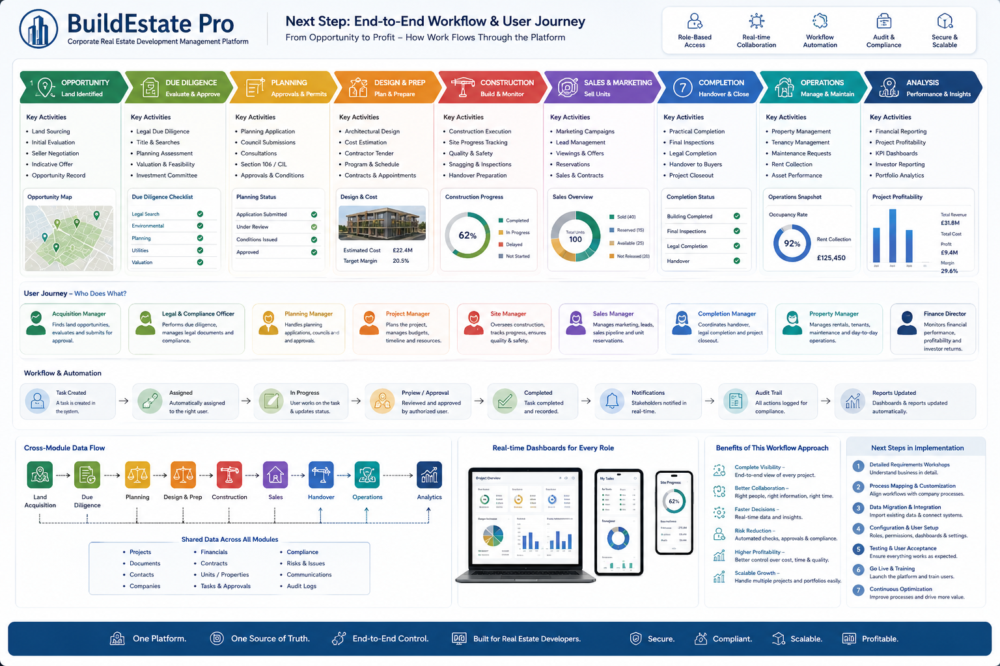
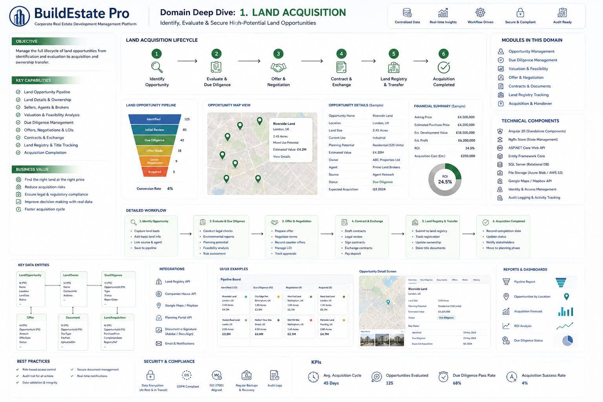
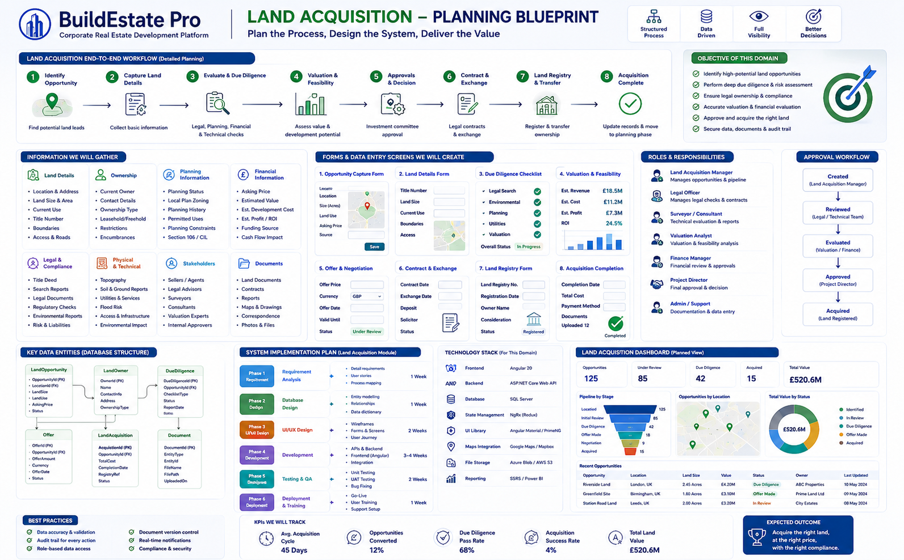
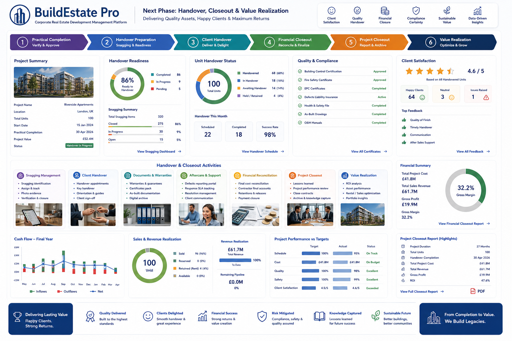

# BuildEstate Pro — Property Development Lifecycle Platform

**End-to-End Management of Real Estate Development Projects — From Land to Legacy**

BuildEstate Pro is an enterprise-grade corporate real estate development management platform. It covers the entire property development lifecycle — from identifying land opportunities, through planning, construction, sales, handover, and long-term asset management. Built for UK-based real estate developers who need a single source of truth across all project phases.

---

## 🏗️ Project Overview


The platform is structured around **14 interconnected modules** that cover every phase of property development:

| # | Module | Purpose |
|---|--------|---------|
| 1 | Land Acquisition | Find, evaluate, and secure land opportunities |
| 2 | Planning & Approvals | Manage planning applications and council approvals |
| 3 | Legal & Compliance | Contracts, land registry, title deeds, audit trail |
| 4 | Project Management | Planning, milestones, timelines, tasks, risks |
| 5 | Construction Management | Stages, progress tracking, inspections, snagging |
| 6 | Procurement & Materials | Purchase orders, suppliers, materials tracking |
| 7 | Contractors & Suppliers | Contractor database, performance, payments |
| 8 | Finance & Budget Control | Budget planning, cost tracking, cash flow |
| 9 | Investors & Funding | Investor profiles, funding rounds, returns |
| 10 | Property Units | Unit configuration, details, status, availability |
| 11 | Sales & Conveyancing | Leads, viewings, reservations, sales pipeline |
| 12 | Rental Management | Tenants, leases, rent collection, maintenance |
| 13 | Documents & Knowledge | Document repository, version control, templates |
| 14 | Reports & Dashboards | Executive dashboards, financial/sales/construction reports |

The platform provides a centralized dashboard showing portfolio-level metrics: total projects (12), total units (1,248), project value (£520.6M), with real-time visibility into project progress, budget vs actual, construction progress, sales status, and upcoming milestones.

**Platform Foundation** includes role-based access control, workflow & approvals engine, document management, notifications, audit logs, integrations (email, APIs), and security & data protection.

---

## 📋 Module Capabilities (In Depth)


Each of the 14 modules provides comprehensive capabilities:

- **Land Acquisition** — Land opportunity pipeline, evaluation reports, feasibility summaries, and approved land purchase tracking
- **Planning & Approvals** — Application timeline management, conditions tracking, and approved planning permission records
- **Legal & Compliance** — Legally compliant projects, contract registers, and compliance certificates with full audit trail
- **Project Management** — Project plans, progress reports, risk & issue logs with milestone-driven scheduling
- **Construction Management** — Real-time site progress (68% average), inspection reports, and snagging lists
- **Procurement & Materials** — Purchase orders with supplier and inventory management, delivery tracking via GRN
- **Contractors & Suppliers** — Contractor/supplier database with pre-qualification, performance evaluation, and payment history
- **Finance & Budget Control** — Budget vs actual tracking (cash flow forecasts), cost tracking, invoices & payments, variations & claims
- **Investors & Funding** — Investor statements, funding reports, ROI overview (18.7% example), and compliance/KYC management
- **Property Units** — Unit register with availability reports (100 units example), status dashboard by type/floor/status
- **Sales & Conveyancing** — Sales pipeline tracking (viewings → reservations → sales → completion), conveyancing process management
- **Rental Management** — Occupancy management (92% rate), rent collection (£15,450), maintenance requests, tenant communications
- **Documents & Knowledge** — Centralized repository (2,500 documents) with version control, approval workflows, and search
- **Reports & Dashboards** — Real-time dashboards, custom report builder with £520.6M total value and £68.4M profit tracking

**Cross-Cutting Capabilities:** Role-based access control, audit logs & activity tracking, notifications & alerts, workflow & approvals, data security & backups, multi-currency & multi-language, mobile & cloud ready.

**Built for International Standards:** ISO 9001, ISO 27001, GDPR, IFRS, AML, RICS, CSCS, Local Government Compliance.

---

## 🔄 End-to-End Workflow & User Journey



The platform manages the complete property development lifecycle through **8 sequential phases**:

1. **Opportunity** — Land sourcing, initial evaluation, seller negotiation, indicative offer, opportunity record
2. **Due Diligence** — Legal due diligence, title & searches, planning assessment, valuation & feasibility, investment committee
3. **Planning** — Planning application, council submissions, consultations, Section 106/CIL, approvals & conditions
4. **Design & Prep** — Architectural design, cost estimation, contractor tender, program & schedule, contracts & appointments
5. **Construction** — Construction execution, site progress tracking (62% avg), quality & safety, snagging & inspections, handover preparation
6. **Sales & Marketing** — Marketing campaigns, lead management, viewings & offers, reservations, sales & contracts
7. **Completion** — Practical completion, final inspections, legal completion, handover to buyers, project closeout
8. **Operations** — Property management, tenancy management, maintenance requests, rent collection, asset performance

**User Journey — Who Does What:**
Each phase is owned by specific roles (Acquisition Manager → Legal Officer → Planning Manager → Project Manager → Site Manager → Sales Manager → Completion Manager → Property Manager → Finance Director), ensuring clear accountability.

**Workflow & Automation:**
Tasks follow a lifecycle: Created → Assigned → In Progress → Review/Approval → Completed → Notifications → Audit Trail → Reports Updated. All actions are logged, dashboards update automatically.

**Cross-Module Data Flow:**
Data flows seamlessly from Land Acquisition → Due Diligence → Planning → Design & Prep → Construction → Sales → Handover → Operations → Analytics, with shared data entities (projects, documents, contacts, companies, financials, contracts, units, tasks, compliance, risks, communications, audit logs) accessible across all modules.

---

## 🏞️ Domain Deep Dive: Land Acquisition



The Land Acquisition module is the most detailed and serves as the **foundation module** — establishing patterns that all other modules follow.

**Objective:** Manage the full lifecycle of land opportunities from identification and evaluation to acquisition and ownership transfer.

**Land Acquisition Lifecycle (6 Steps):**
1. **Identify Opportunity** — Capture land leads, basic info, link source & agent, save to pipeline
2. **Evaluate & Due Diligence** — Legal checks, environmental reports, planning potential, feasibility analysis, risk assessment
3. **Offer & Negotiation** — Prepare offer, negotiate terms, record counter-offers, manage LOI, track approvals
4. **Contract & Exchange** — Draft contracts, legal review, sign contracts, exchange contracts, pay deposit
5. **Land Registry & Transfer** — Submit to registry, track registration, update ownership, store title documents
6. **Acquisition Completed** — Record completion date, update status, notify stakeholders, move to planning phase

**Key Data Entities:**
- `LandOpportunity` — Id, Name, Location, LandSize, Status, Source, ExpectedAcquisition
- `LandOwner` — Id, Name, ContactDetails, Address, OwnershipType
- `DueDiligence` — Id, OpportunityId, Type, Status, ReportDate, Findings
- `Offer` — Id, OpportunityId, Amount, OfferDate, Currency, ValidUntil, Status
- `Document` — Id, OpportunityId, DocType, FilePath, UploadedAt
- `LandAcquisition` — Id, OpportunityId, PurchasePrice, CompletionDate, RegistryRef, Status

**Pipeline Metrics (Example):** 125 Identified → 85 Initial Review → 42 Due Diligence → 18 Offer Made → 9 Under Contract → 5 Acquired

**KPIs:** Avg. Acquisition Cycle: 45 Days | Opportunities Evaluated: 125 | Due Diligence Pass Rate: 68% | Acquisition Success Rate: 4%

**Financial Summary (Example):** Asking Price £4,500,000 | Estimated Purchase £4,200,000 | Est. Profit £4,200,000 | ROI 24.5%

---

## 📐 Land Acquisition — Planning Blueprint



This image details the **implementation blueprint** for the Land Acquisition domain — the plan for how we design the system, define forms, assign roles, and structure the technology.

**Detailed 7-Step Workflow:**
1. Identify Opportunity → 2. Capture Land Details → 3. Evaluate & Due Diligence → 4. Valuation & Feasibility → 5. Approvals & Decision → 6. Contract & Exchange → 7. Land Registry & Transfer

**Information Gathered Per Opportunity:**
- **Land Details:** Location & address, size & area, current use, title number, boundaries, access & roads
- **Ownership:** Current owner, contact details, ownership type, leasehold/freehold, encumbrances
- **Planning Info:** Planning status, local plan zoning, history, permitted uses, constraints, Section 106/CIL
- **Financial Info:** Asking price, estimated value, development cost, profit/ROI, funding source, cash flow impact
- **Legal & Compliance:** Title deed, search reports, legal documents, regulatory checks, environmental reports, risk & liabilities
- **Physical & Technical:** Topography, soil reports, utilities, flood risk, access & infrastructure, environmental impact

**Forms & Data Entry Screens (8 total):**
Opportunity Capture → Land Details → Due Diligence Checklist → Valuation & Feasibility → Offer & Negotiation → Contract & Exchange → Land Registry → Acquisition Completion

**Approval Workflow:** Created (Acquisition Manager) → Reviewed (Legal/Technical Team) → Evaluated (Valuation/Finance) → Approved (Project Director) → Acquired (Land Registered)

**Roles & Responsibilities:** Acquisition Manager, Legal Officer, Surveyor/Consultant, Valuation Analyst, Finance Manager, Project Director, Admin/Support

**Technology Stack:**
- Frontend: Angular 20 (Standalone Components)
- Backend: ASP.NET Core Web API
- Database: SQL Server
- State Management: NgRx (Redux)
- UI Library: Angular Material / PrimeNG
- Maps: Google Maps / Mapbox API
- File Storage: Azure Blob / AWS S3
- Identity: Identity & Access Management
- Audit: Audit Logging & Activity Tracking

**System Implementation Plan (6 Phases):**
Phase 1: Requirements Analysis (1 week) → Phase 2: Database Design (1 week) → Phase 3: UI/UX Design (2 weeks) → Phase 4: Development (3-4 weeks) → Phase 5: Testing & QA (2 weeks) → Phase 6: Deployment & Training (1 week)

**KPIs We Will Track:** Avg. Acquisition Cycle: 45 Days | Opportunities Converted: 12% | Due Diligence Pass Rate: 68% | Acquisition Success Rate: 4%

---

## 🤝 Handover, Closeout & Value Realization



The final phase ensures quality delivery, happy clients, and maximum returns through a structured 6-step handover process.

**Handover Process:**
1. **Practical Completion** — Verify & Approve
2. **Handover Preparation** — Snagging & Readiness (86% ready, 320 snagging items tracked)
3. **Client Handover** — Deliver & Delight (98% success rate, 22 scheduled / 18 completed this month)
4. **Financial Closeout** — Reconcile & Finalize
5. **Project Closeout** — Report & Archive
6. **Value Realization** — Optimize & Grow

**Unit Handover Status (100 Total Units):** 65 Handovered (65%) | 18 In Handover (18%) | 14 Awaiting (14%) | 4 Held/Returned (4%)

**Quality & Compliance:** Building Control Certification ✓ | Fire Safety Certificate ✓ | EPC Certificates ✓ | Defects Liability Insurance ✓ | Health & Safety File ✓ | As-Built Drawings ✓ | O&M Manuals ✓

**Client Satisfaction:** 4.6/5 rating | 64 happy clients | Top feedback: Quality of Finish, Timely Handover, Communication, After Sales Support

**Handover & Closeout Activities:**
- Snagging Management (identification, assign & track, photo evidence, verification & closure)
- Client Handover (appointments, key handover, orientation guides, client sign-off)
- Documents & Warranties (warranties, certificates pack, as-built documentation, digital archive)
- Aftercare & Support (defects portal, SLA tracking, resolution management, client communication)
- Financial Reconciliation (final cost reconciliation, contractor final accounts, retentions & releases)
- Project Closeout (lessons learned, performance review, close contracts, archive & knowledge capture)
- Value Realization (ROI analysis, asset performance, rental/sales optimization, portfolio insights)

**Financial Summary (Example Project):**
- Total Project Cost: **£41.8M**
- Total Sales Revenue: **£61.7M**
- Gross Profit: **£19.9M**
- Gross Margin: **32.2%**
- ROI: **47.6%**
- Project Duration: 27 Months

**Project Performance vs Targets:**
- Schedule: 95% actual vs 100% target — On Track
- Cost: £41.8M actual vs £41.8M target — On Budget
- Quality: 98% actual vs 100% target — Excellent
- Safety: 99% actual vs 100% target — Excellent
- Client Satisfaction: 4.6/5 actual vs 4.5/5 target — Exceeded

---

## 🛠️ Technology Stack

| Layer | Technology |
|-------|-----------|
| **Frontend** | Angular 20 (Standalone Components), NgRx Store, Angular Material / PrimeNG, SCSS |
| **Backend** | ASP.NET Core Web API (.NET 10), C#, MediatR (CQRS), FluentValidation, AutoMapper |
| **Database** | SQL Server, Entity Framework Core (Code-First) |
| **Authentication** | ASP.NET Identity + JWT Bearer tokens |
| **File Storage** | Azure Blob Storage / AWS S3 |
| **Maps** | Google Maps / Mapbox API |
| **API Docs** | Swagger / OpenAPI |
| **Architecture** | Clean Architecture (Domain → Application → Infrastructure → API) |

---

## 📁 Solution Structure

```
real-estate/
├── .kiro/steering/              # AI steering files (project context & conventions)
├── backend/
│   ├── BuildEstate.slnx         # .NET Solution
│   └── src/
│       ├── BuildEstate.API/             # Web API (Controllers, Middleware, Program.cs)
│       ├── BuildEstate.Application/     # CQRS, DTOs, Validators, Mappings
│       ├── BuildEstate.Domain/          # Entities, Enums, Interfaces
│       ├── BuildEstate.Infrastructure/  # EF Core, Identity, Repositories, Persistence
│       └── BuildEstate.Shared/          # Response models, Exceptions, Pagination
├── frontend/                    # Angular 20 Application
│   ├── src/app/
│   ├── angular.json
│   └── package.json
├── *.png                        # Architecture & domain diagrams
└── README.md
```

---

## 🏛️ Architecture

The backend follows **Clean Architecture** principles:

- **Domain Layer** — Pure business entities, enums, and interface contracts (zero dependencies)
- **Application Layer** — Use cases via MediatR commands/queries, validation, mapping profiles
- **Infrastructure Layer** — EF Core DbContext, repository implementations, Identity, external integrations
- **API Layer** — Thin controllers, JWT authentication, Swagger docs, global exception handling

The frontend follows **feature-based modular architecture** with lazy-loaded routes, smart/dumb component patterns, and NgRx state management per feature slice.

---

## 🚀 Getting Started

### Prerequisites
- .NET SDK 10.0+
- Node.js 20+
- Angular CLI 21+
- SQL Server (Express edition is fine)

### Backend Setup
```bash
cd backend
dotnet restore
dotnet build

# Update connection string in src/BuildEstate.API/appsettings.json if needed
# Default: Server=.\SQLEXPRESS;Database=BuildEstateDb;Trusted_Connection=True;

dotnet ef migrations add InitialCreate --project src/BuildEstate.Infrastructure --startup-project src/BuildEstate.API
dotnet ef database update --project src/BuildEstate.Infrastructure --startup-project src/BuildEstate.API

dotnet run --project src/BuildEstate.API
# API available at https://localhost:5001
# Swagger UI at https://localhost:5001/swagger
```

### Frontend Setup
```bash
cd frontend
npm install
ng serve
# App available at http://localhost:4200
```

### Default Admin Credentials
- Email: `admin@buildestate.co.uk`
- Password: `Admin@123456`
- Role: SuperAdmin

---

## 📊 Key Metrics & KPIs

| Metric | Value |
|--------|-------|
| Total Modules | 14 |
| Average Acquisition Cycle | 45 Days |
| Due Diligence Pass Rate | 68% |
| Construction Progress (Avg) | 62% |
| Client Satisfaction | 4.6 / 5 |
| Gross Margin (Example) | 32.2% |
| ROI (Example) | 47.6% |

---

## 🗺️ Roadmap

The platform is being built incrementally, starting with Module 1 (Land Acquisition) as the foundation:

1. ✅ **Land Acquisition** — Foundation module (current)
2. ⬜ Planning & Approvals
3. ⬜ Legal & Compliance
4. ⬜ Project Management
5. ⬜ Construction Management
6. ⬜ Finance & Budget Control
7. ⬜ Property Units
8. ⬜ Sales & Conveyancing
9. ⬜ Procurement & Materials
10. ⬜ Contractors & Suppliers
11. ⬜ Investors & Funding
12. ⬜ Rental Management
13. ⬜ Documents & Knowledge
14. ⬜ Reports & Dashboards

---

## 📄 License

Proprietary — All rights reserved.

---

## 👥 Team

Built by the BuildEstate Pro development team. Designed for real estate developers who demand complete control over their developments.

> *"One Platform. One Source of Truth. End-to-End Control. Built for Real Estate Developers. Secure. Compliant. Scalable. Profitable."*
